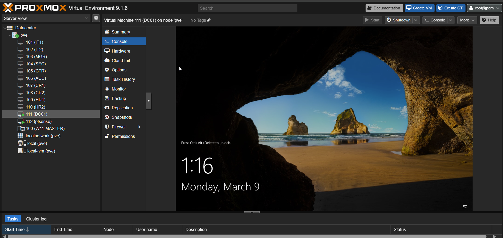
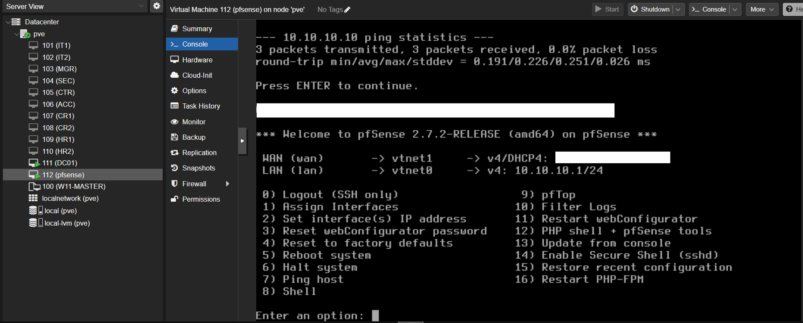
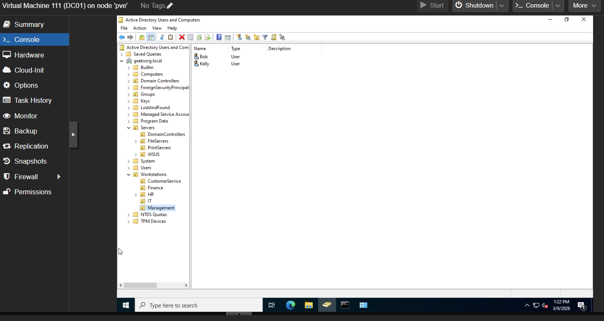
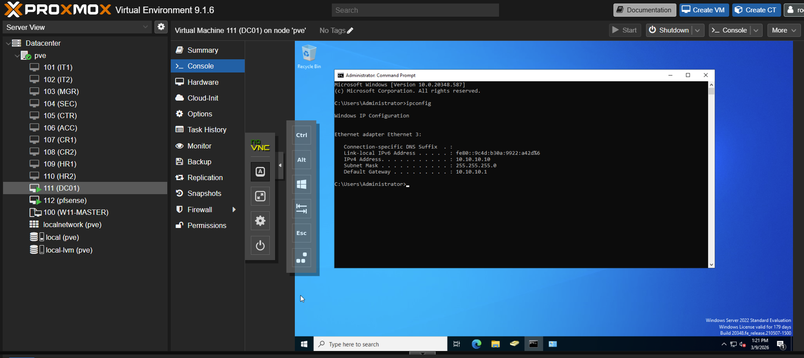
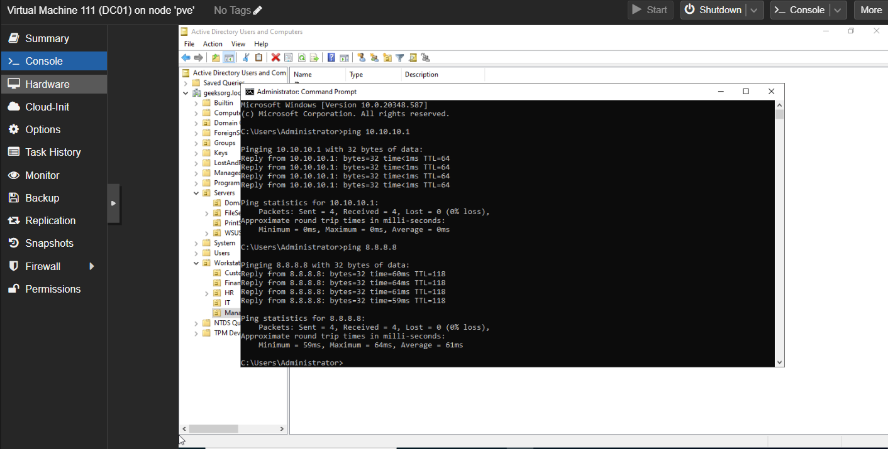

# Proxmox Active Directory Security Lab

This repository documents the buildout of a simulated enterprise network environment designed for cybersecurity training and SOC (Security Operations Center) practice.

The lab is hosted on a Proxmox virtualization platform and includes an internal firewall, Active Directory domain, multiple workstations, and planned SIEM monitoring.

This environment is isolated and built for educational and security research purposes.

---

# Lab Goals

The goal of this lab is to replicate a small enterprise environment that can be used to practice:

- Active Directory administration
- Network segmentation
- Firewall configuration
- Security monitoring
- SIEM deployment
- Attack simulation and detection

The lab will eventually be used to simulate real-world security scenarios for blue team training.

---

# Infrastructure

Hypervisor

Proxmox VE is used as the virtualization platform hosting all virtual machines.

Firewall

The network is segmented using a pfSense firewall which separates the internal enterprise network from external connectivity.

Domain Services

Windows Server 2022 is used as the Domain Controller for Active Directory.

Workstations

Multiple Windows 11 virtual machines simulate employees across different departments within an organization.

---

# Virtual Machine Layout

The lab simulates multiple departments within a small company.

DC01 – Domain Controller  
pfSense – Firewall  

IT1 – IT Department  
IT2 – IT Department  

MGR – Management  
SEC – Security  

CTR – Customer Service  
ACC – Accounting  

CR1 – Customer Relations  
CR2 – Customer Relations  

HR1 – Human Resources  
HR2 – Human Resources  

These systems allow for testing of domain authentication, group policies, user management, and security monitoring.

---

# Network Architecture

The environment uses a segmented network to simulate a real enterprise infrastructure.

Internet  
│  
Firewall (pfSense)  
│  
Internal Network  
10.10.10.0/24  

Core infrastructure:

10.10.10.1 – Firewall (Gateway)  
10.10.10.10 – Domain Controller  
10.10.10.20 – WSUS Server (planned)  
10.10.10.30 – File Server (planned)  
10.10.10.40 – Print Server (planned)  
10.10.10.50 – SIEM Server (planned)  
10.10.10.60+ – Workstations  

All internal machines communicate through the firewall gateway.

---

# Active Directory Design

The domain structure is organized using Organizational Units (OUs) to simulate departments within an enterprise environment.

Workstations  
• IT  
• Management  
• Finance  
• HR  
• CustomerService  

Servers  
• DomainControllers  
• FileServers  
• WSUS  
• PrintServers  

Users were created within each department to simulate real organizational accounts.

---

# Current Progress

Completed:

- Proxmox hypervisor deployment
- Virtual network segmentation
- pfSense firewall deployment
- Internal network architecture design
- Windows Server 2022 domain controller
- Active Directory domain setup
- Organizational Unit structure
- Departmental user accounts
- Windows workstation VM cloning

---

# Planned Enhancements

The next stages of this lab include expanding the security monitoring capabilities.

Planned additions:

- Wazuh SIEM deployment
- Windows event log forwarding
- Security alert monitoring
- Attack simulations
- Detection engineering
- Group Policy security hardening
- SOC investigation workflows

---

# Screenshots

Proxmox Infrastructure

pfSense Firewall

Active Directory Structure

Domain Controller Network Configuration

Network Connectivity Test

---

# Future Development

This repository will continue to document the deployment of additional infrastructure and security monitoring tools as the lab evolves into a fully functional SOC training environment.
