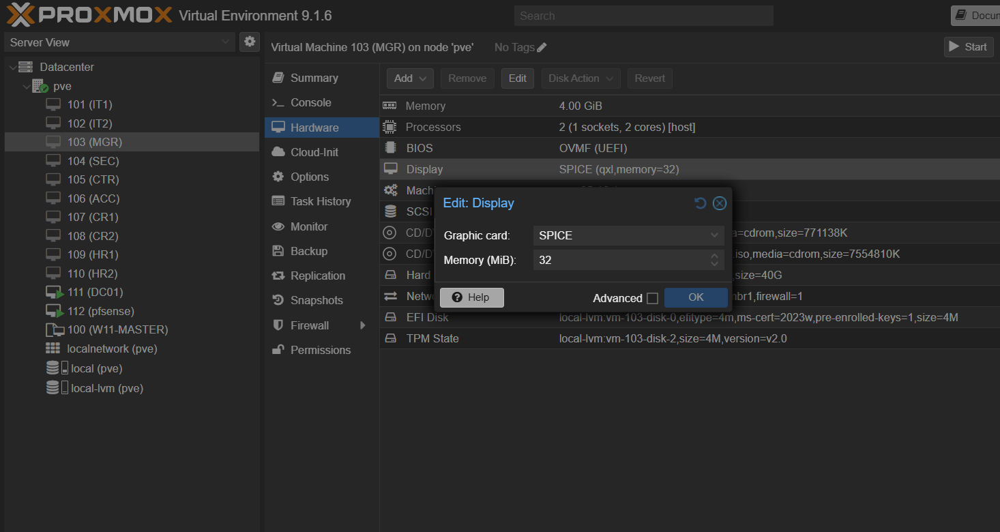
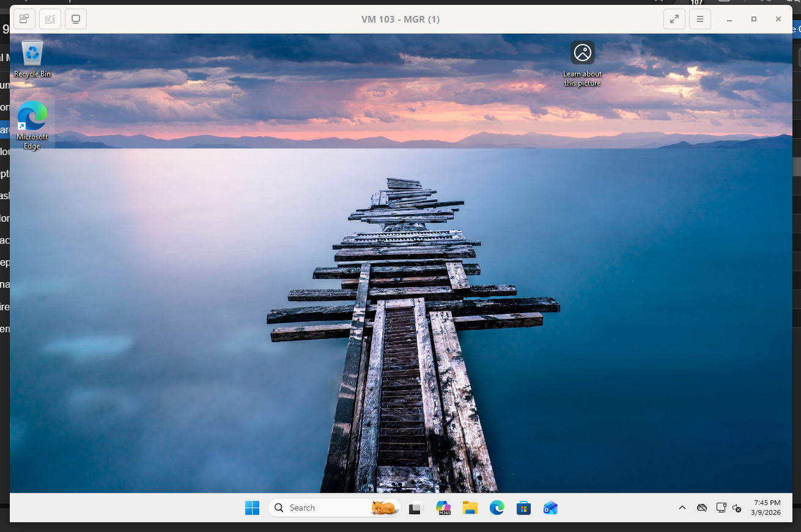
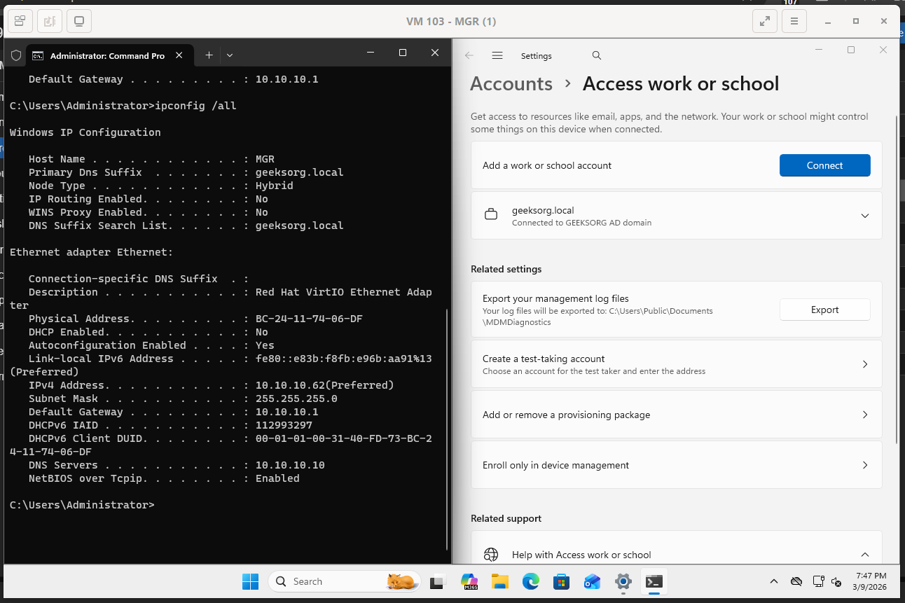
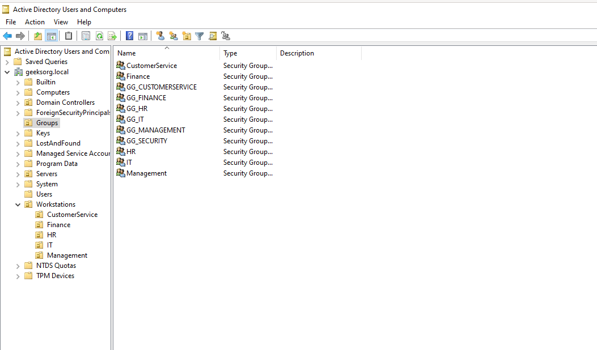
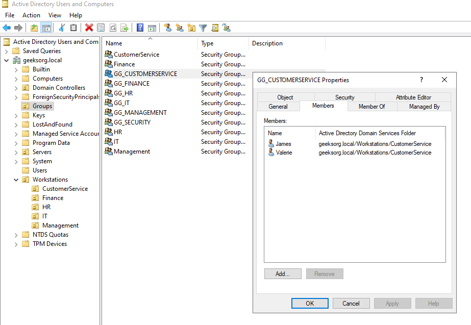
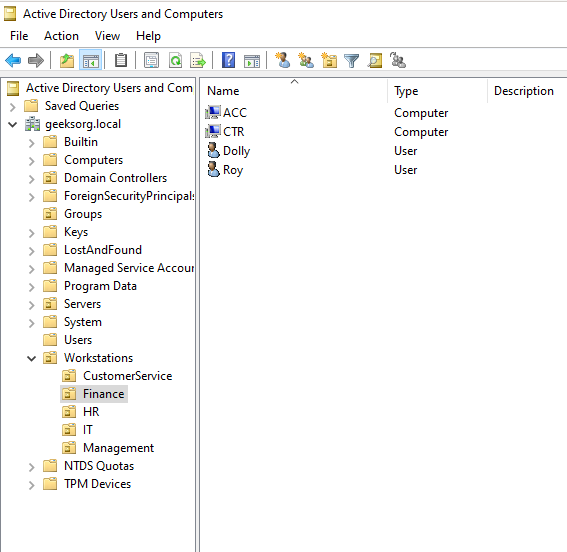

# Proxmox Active Directory Security Lab

This repository documents the buildout of a simulated enterprise network environment designed for cybersecurity training and SOC (Security Operations Center) practice.

The lab is hosted on a Proxmox virtualization platform and includes an internal firewall, Active Directory domain, multiple workstations, and planned SIEM monitoring.

This environment is isolated and built for educational and security research purposes.

---

# Lab Goals

The goal of this lab is to replicate a small enterprise environment that can be used to practice:

- Active Directory administration
- Network segmentation
- Firewall configuration
- Security monitoring
- SIEM deployment
- Attack simulation and detection

The lab will eventually be used to simulate real-world security scenarios for blue team training.

---

# Infrastructure

Hypervisor

Proxmox VE is used as the virtualization platform hosting all virtual machines.

Firewall

The network is segmented using a pfSense firewall which separates the internal enterprise network from external connectivity.

Domain Services

Windows Server 2022 is used as the Domain Controller for Active Directory.

Workstations

Multiple Windows 11 virtual machines simulate employees across different departments within an organization.

---

# Network Topology

```
                Internet
                    │
                    │
              pfSense Firewall
                    │
                    │
            Internal Network (10.10.10.0/24)
                    │
        ┌───────────┼───────────┐
        │           │           │
      DC01       Workstations   Servers
  (Domain Ctrl)                 (Planned)
        │           │           │
        │           │           ├─ FS01  (File Server)
        │           │           ├─ WSUS01 (WSUS Server)
        │           │           ├─ PRN01 (Print Server)
        │           │           └─ SIEM01 (Wazuh SIEM)
        │           │
        │           ├─ IT1
        │           ├─ IT2
        │           ├─ MGR
        │           ├─ SEC
        │           ├─ CTR
        │           ├─ ACC
        │           ├─ CR1
        │           ├─ CR2
        │           ├─ HR1
        │           └─ HR2
```

---

# Virtual Machine Layout

The lab simulates multiple departments within a small company.

DC01 – Domain Controller  
pfSense – Firewall  

IT1 – IT Department  
IT2 – IT Department  

MGR – Management  
SEC – Security  

CTR – Customer Service  
ACC – Accounting  

CR1 – Customer Relations  
CR2 – Customer Relations  

HR1 – Human Resources  
HR2 – Human Resources  

These systems allow for testing of domain authentication, group policies, user management, and security monitoring.

---

# Network Architecture

The environment uses a segmented network to simulate a real enterprise infrastructure.

Internet  
│  
Firewall (pfSense)  
│  
Internal Network  
10.10.10.0/24  

Core infrastructure:

10.10.10.1 – Firewall (Gateway)  
10.10.10.10 – Domain Controller  
10.10.10.20 – WSUS Server (planned)  
10.10.10.30 – File Server (planned)  
10.10.10.40 – Print Server (planned)  
10.10.10.50 – SIEM Server (planned)  
10.10.10.60+ – Workstations  

All internal machines communicate through the firewall gateway.

---

# Active Directory Design

The domain structure is organized using Organizational Units (OUs) to simulate departments within an enterprise environment.

Workstations  
• IT  
• Management  
• Finance  
• HR  
• CustomerService  

Servers  
• DomainControllers  
• FileServers  
• WSUS  
• PrintServers  

Users were created within each department to simulate real organizational accounts.

---

# Current Progress

Completed:

- Proxmox hypervisor deployment
- Virtual network segmentation
- pfSense firewall deployment
- Internal network architecture design
- Windows Server 2022 domain controller
- Active Directory domain setup
- Organizational Unit structure
- Departmental user accounts
- Windows workstation VM cloning

---

# Planned Enhancements

The next stages of this lab include expanding the security monitoring capabilities.

Planned additions:

- Wazuh SIEM deployment
- Windows event log forwarding
- Security alert monitoring
- Attack simulations
- Detection engineering
- Group Policy security hardening
- SOC investigation workflows

---

# Screenshots

Proxmox Infrastructure


pfSense Firewall


Active Directory Structure


Domain Controller Network Configuration


Network Connectivity Test


---

# Workstations Domain Join

## Objective

After deploying the Domain Controller (`DC01`) and configuring the internal network using `pfSense`, the next phase of the lab was integrating Windows workstations into the Active Directory domain.

Joining endpoints to the domain enables centralized authentication, Group Policy enforcement, and role-based access control across the simulated enterprise environment.

---

# Lab Environment

## Domain Controller

```
Hostname: DC01
OS: Windows Server 2022
Role: Active Directory Domain Services
IP Address: 10.10.10.10
Domain: geeksorg.local
```

---

## Network

```
Network: 10.10.10.0/24
Gateway: pfSense (10.10.10.1)
DNS Server: DC01 (10.10.10.10)
```

The Domain Controller acts as the internal DNS server, which is required for proper Active Directory functionality.

---

# Workstations

The following Windows 11 systems were deployed from a master template and represent various departments in the simulated organization.

```
IT1
IT2
MGR
SEC
CTR
ACC
CR1
CR2
HR1
HR2
```

These machines simulate a corporate workstation environment and will later be used for testing:

- Group Policy
- File Server permissions
- Patch management
- Security monitoring

---

# Proxmox Console Optimization

To improve console responsiveness when interacting with Windows virtual machines, the VM display configuration was updated.

```
Display: SPICE
Video Adapter: QXL
Video Memory: 32 MB
```

Additionally, `virt-viewer` was installed on the management workstation to connect directly to VM consoles using SPICE, providing significantly better performance than the default Proxmox web console.

---

# Automated Domain Join Script

To streamline the process of configuring multiple workstations, a PowerShell script was used to automate:

- Static IP assignment
- DNS configuration
- Computer renaming
- Domain join

```
# --- 1. GET USER INPUT ---
$octet     = Read-Host "Enter the last digit for the IP (e.g., 62)"
$PCName    = Read-Host "Enter the NEW computer name (e.g., IT2)"
$ipAddress = "10.10.10.$octet"
$gateway   = "10.10.10.1"
$dns       = "10.10.10.10"
$mask      = 24

$domain    = "geeksorg.local"
$user      = "GEEKSORG\Administrator"
$pass      = 'REDACTED'

# --- 2. CHANGE IPv4 SETTINGS ---
Write-Host "Step 1: Setting IP to $ipAddress and DNS to $dns..." -ForegroundColor Cyan
$adapter = Get-NetAdapter | Where-Object { $_.Status -eq "Up" } | Select-Object -First 1

New-NetIPAddress -InterfaceIndex $adapter.InterfaceIndex -IPAddress $ipAddress -PrefixLength $mask -DefaultGateway $gateway -Confirm:$false
Set-DnsClientServerAddress -InterfaceIndex $adapter.InterfaceIndex -ServerAddresses $dns

ipconfig /flushdns
ipconfig /registerdns

# --- 3. CHANGE PC NAME & JOIN DOMAIN ---
Write-Host "Step 2: Renaming to $PCName and Joining $domain..." -ForegroundColor Cyan

$securePass = ConvertTo-SecureString $pass -AsPlainText -Force
$creds = New-Object System.Management.Automation.PSCredential ($user, $securePass)

# --- 4. FINAL DOMAIN JOIN & RESTART ---
Add-Computer -DomainName $domain -NewName $PCName -Credential $creds -Restart -Force -Verbose
```

This script significantly reduced manual configuration steps when deploying multiple workstation systems.

---

# Verification

After joining the domain, the workstations appeared in **Active Directory Users and Computers** under the default `Computers` container.

Administrators can later move these machines into Organizational Units (OUs) to apply Group Policy and departmental access controls.

---

# Result

All workstation systems were successfully joined to the `geeksorg.local` domain.

This establishes the foundation required for the next stages of the lab, including:

- Organizational Unit structure
- Security group management
- File server deployment
- WSUS patch management
- Wazuh SIEM monitoring
- attack simulation
  
## ## Domain Join Screenshots

### Proxmox SPICE Display Configuration

The VM display settings were changed to use **SPICE with QXL** to improve console performance when interacting with Windows virtual machines.



---

### virt-viewer Console

The `virt-viewer` client was used to connect directly to VM consoles using the SPICE protocol, providing a smoother experience than the default Proxmox web console.



---

### Workstation Joined to Domain

Example of a Windows workstation successfully joined to the `geeksorg.local` Active Directory domain.



---

### Workstations Visible in Active Directory

After joining the domain, all workstations appear in **Active Directory Users and Computers**, allowing administrators to organize systems into Organizational Units (OUs) and apply Group Policy.

---

# Role-Based Access Control (RBAC)

## Objective

After deploying Active Directory and joining workstations to the domain, the next step was implementing **Role-Based Access Control (RBAC)** using Active Directory security groups.

RBAC simplifies permission management by assigning permissions to groups rather than individual users. This approach reflects how enterprise environments manage identity and access control.

---

## Department Security Groups

Security groups were created to represent each department within the organization.

These groups will later be used to control access to shared resources such as file servers and internal applications.

Example naming convention:

```
GG_IT
GG_HR
GG_FINANCE
GG_CUSTOMERSERVICE
GG_MANAGEMENT
GG_SECURITY
```

Group configuration:

```
Group Scope: Global
Group Type: Security
```

Global security groups are commonly used in enterprise environments to represent departments or roles.

---

## User Assignment

Users were assigned to their respective department groups using PowerShell.

Example command used in the lab:

```powershell
Add-ADGroupMember -Identity "GG_IT" -Members "admin","joe"
```

This approach allows administrators to manage permissions at the group level instead of assigning access directly to individual users.

---

## Enterprise RBAC Model

The access control model used in this lab follows a simplified enterprise design:

```
User
 ↓
Department Security Group
 ↓
Resource Access
```

This structure improves scalability and reduces administrative overhead when managing permissions across many users and systems.

---

## Screenshots

### Department Security Groups

Security groups representing departments within the organization.



---

### Group Membership Example

Example of users assigned to the IT department security group.



---

### Workstations Organized by Department

Workstations placed into Organizational Units based on department.



---

## Result

The Active Directory environment now includes a functional **RBAC structure** with department-based security groups and users assigned to the appropriate roles.

This configuration will be used in later stages of the lab when deploying shared resources such as:

- File Servers
- Department file shares
- Access-controlled network resources
- Security monitoring and auditing

---

# Future Development

This repository will continue to document the deployment of additional infrastructure and security monitoring tools as the lab evolves into a fully functional SOC training environment.

---

---

# Automation Scripts

Several PowerShell scripts were created to automate common administrative tasks within the lab environment.

These scripts improve deployment speed and demonstrate automation techniques commonly used by system administrators and security engineers.

## Domain Join Automation

A script was used to automate workstation configuration including:

- Static IP assignment
- DNS configuration
- Computer renaming
- Domain joining

Script location:

```
Scripts/domain-join.ps1
```

---

## RBAC Group Creation

Department security groups were created automatically using PowerShell.

Script location:

```
Scripts/create-rbac-groups.ps1
```

---

## User Assignment to Security Groups

Users were assigned to their department groups using PowerShell automation.

Script location:

```
Scripts/assign-users-to-groups.ps1
```

These scripts demonstrate how administrative tasks can be automated when deploying or managing Active Directory environments.
